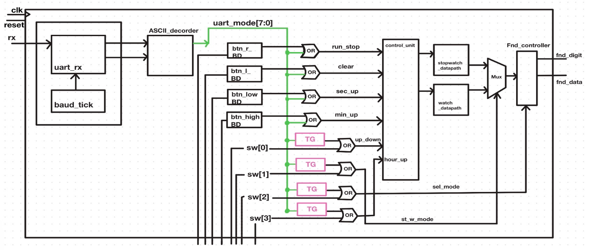
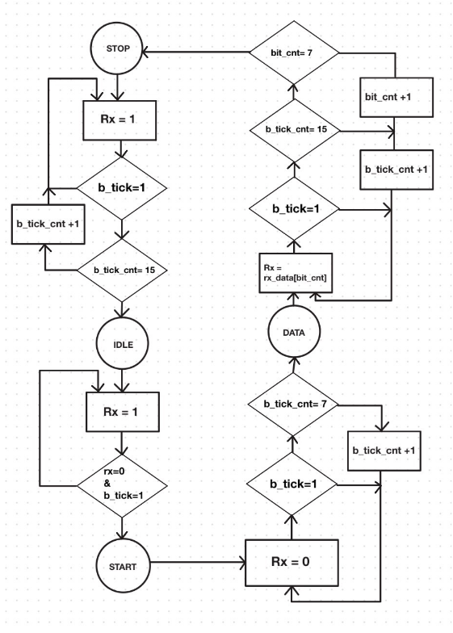
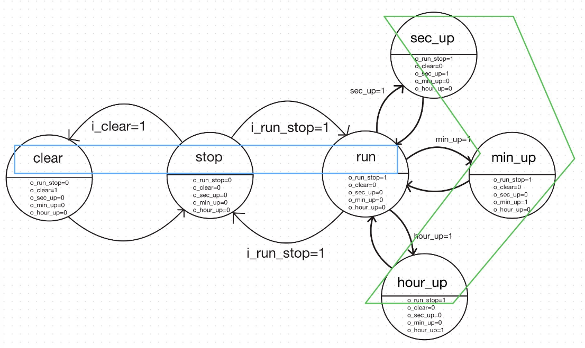
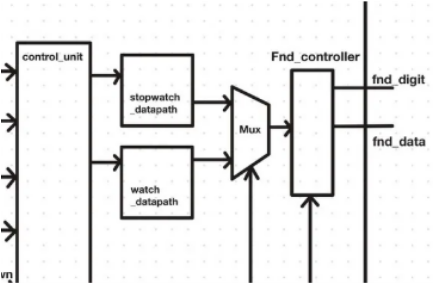
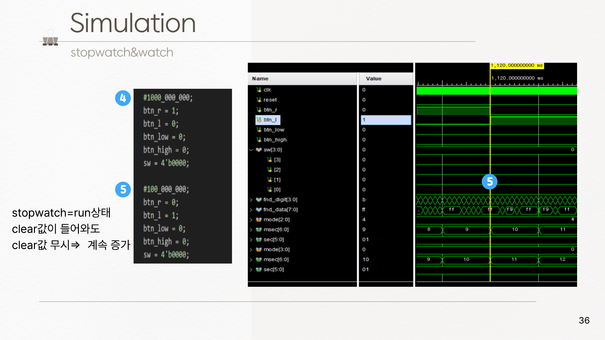

# ⏱ UART 기반 FPGA Stopwatch & Digital Watch

> UART 수신기를 직접 설계해, PC 키보드 입력과 보드 버튼·스위치 입력을 하나의 제어 경로로 통합한 시계·스톱워치 시스템

---

## 📖 Overview

| 항목 | 내용 |
|---|---|
| 구분 | 개인 프로젝트 |
| 환경 | Vivado / Basys3 FPGA (Artix-7), 100MHz |
| 언어 | Verilog |

보드 버튼으로만 조작하던 시계·스톱워치에 **UART 통신을 추가해 PC에서도 동일하게 제어**할 수 있도록 확장했습니다.
UART IP를 가져다 쓰지 않고 수신기를 직접 설계해, 비동기 직렬 통신에서 비트를 어떻게 복원하는지를 RTL 수준에서 익히는 것이 목표였습니다.

**설계 목표 세 가지**

1. 보드 입력(버튼·스위치)과 UART ASCII 데이터를 **하나의 신호로 병합**
2. 시계와 스톱워치를 **독립된 두 datapath**로 분리하고 MUX로 선택 출력
3. FSM과 토글 로직으로 모드·동작 상태 관리

<p align="center">
  <br>
  <em>전체 Block Diagram — UART 경로와 하드웨어 입력이 병합되어 두 datapath로 전달</em>
</p>

---

## ⌨️ 명령 매핑

PC 터미널의 문자 입력과 보드의 물리 입력이 **같은 동작에 대응**되도록 매핑했습니다.

| UART 키 | ASCII | 보드 입력 | 동작 |
|---|---|---|---|
| `r` | `8'h72` | btn_r | run / stop |
| `l` | `8'h6C` | btn_l | clear |
| `u` | `8'h75` | btn_low | sec_up |
| `d` | `8'h64` | btn_down | min_up |
| `0` | `8'h30` | sw[0] | count up / down |
| `1` | `8'h31` | sw[1] | 시계 모드 / 스톱워치 모드 |
| `2` | `8'h32` | sw[2] | 시·분 / 초·밀리초 표시 전환 |
| `3` | `8'h33` | sw[3] | hour_up |

---

## 📡 UART Receiver

### baud_gen — 16배 오버샘플링 tick

```
100_000_000 / (9600 × 16) = 651
→ counter_reg == 650 마다 b_tick 생성
```

UART는 클럭을 함께 보내지 않는 **비동기** 통신이라, 송·수신 클럭에 미세한 오차가 있으면
뒤쪽 비트에서 샘플링 지점이 어긋납니다.
보드레이트의 16배로 tick을 만들어 **각 비트의 가운데 지점**을 찾아 읽도록 설계해,
비트 경계에서 최대한 멀리 떨어진 곳에서 값을 판정하도록 했습니다.

### uart_rx — 4-state FSM

<p align="center">
  <br>
  <em>uart_rx FSM / ASM 차트</em>
</p>

| 전이 | 조건 |
|---|---|
| IDLE → START | `rx` 라인이 1 → 0 (START 비트) 이고 `b_tick == 1` |
| START → DATA | `b_tick_cnt == 7` — 비트 중앙에서 START 비트 재확인 |
| DATA 내부 shift | `b_tick_cnt_reg == 15` 마다 1비트씩 버퍼에 시프트 |
| DATA → STOP | `bit_cnt_reg == 7` — 8비트 수신 완료 |
| STOP → IDLE | `b_tick_cnt_reg == 15` → `done` 1 tick 출력 |

START 상태에서 8 tick(= 비트 중앙)을 기다렸다가 한 번 더 확인하는 이유는,
순간적인 노이즈를 START 비트로 오인하면 **그 뒤 8비트가 통째로 잘못 읽히기** 때문입니다.

---

## 🔀 입력 병합 — ASCII Decoder · sw_toggle · or_gate

### ascii_decoder

`uart_done == 1`인 순간의 `uart_data`를 보고, 대응하는 내부 제어 신호로 변환합니다.

```
uart_data = 8'h72 ('r')  →  uart_mode = 2'b01 (RUN)
```

### 🔍 Troubleshooting — 스위치 명령만 인식되지 않는 문제

**증상**
ASCII decoder가 만든 `uart_tick` 신호를 보드의 버튼·스위치 신호와 함께 OR 게이트에 넣었더니,
**버튼에 대응하는 명령(`r`, `l`, `u`, `d`)은 정상 동작하는데 스위치에 대응하는 명령(`0`~`3`)은 먹지 않았습니다.**

**원인**
버튼과 스위치는 신호의 성격이 다릅니다.

| | 신호 형태 | decoder 출력과의 관계 |
|---|---|---|
| 버튼 | 눌린 순간의 **펄스** | tick과 형태가 같아 그대로 OR 가능 |
| 스위치 | 올려둔 동안 유지되는 **레벨** | tick은 1클럭이라 OR 결과가 곧 사라짐 |

decoder는 어떤 명령이든 1클럭짜리 tick을 내보내는데, 스위치 쪽 로직은 **레벨이 유지되는 것**을 전제로
동작하고 있었기 때문에 순간적인 tick으로는 상태가 바뀌지 않았습니다.

**해결 — sw_toggle 모듈 추가**
tick을 받아 내부 상태를 반전시키고, 그 **상태값을 레벨 신호로 유지**해 OR 게이트에 전달하도록 했습니다.

```
state = 0  --tick-->  state = 1  --tick-->  state = 0
```

이제 UART로 `1`을 한 번 보내면 스위치를 올린 것과 동일한 상태가 유지되고,
다시 보내면 내린 것과 같아집니다.

**배운 점**
서로 다른 입력 수단을 하나로 합칠 때는 **신호의 형태(펄스 vs 레벨)를 먼저 맞춰야** 한다는 것을 배웠습니다.
기능이 같다고 해서 그대로 OR로 묶으면 동작하지 않습니다.

### or_gate

`uart_mode`(UART 경로)와 `orig_mode`(하드웨어 경로) 중 **하나라도 1이면 1**을 출력합니다.
두 입력 수단 어느 쪽으로도 보드를 동일하게 조작할 수 있게 하는 지점입니다.

---

## 🎛 Control Unit

Moore 방식 FSM으로 동작 상태를 관리합니다.

```verilog
localparam [3:0] STOP    = 4'b0000,
                 RUN     = 4'b0001,
                 CLEAR   = 4'b0010,
                 SEC_UP  = 4'b0100,
                 MIN_UP  = 4'b1000,
                 HOUR_UP = ...;
```

<p align="center">
  <br>
  <em>Control Unit FSM</em>
</p>

### 🔍 Troubleshooting — hour_up이 랜덤하게 증가하는 문제

**증상**
시뮬레이션에서는 정상이었지만, 실제 보드에서 `hour_up` 스위치를 올리면
**시간 값이 한 번이 아니라 계속 올라갔습니다.**

**원인**
`hour_up`은 스위치 신호라 한 번 올리면 다음 조작 전까지 **1이 유지**됩니다.
그런데 Control Unit은 `hour_up == 1`을 "계속 올려라"는 의미로 해석하고 있어서,
스위치를 올려둔 동안 매 클럭 값이 증가했습니다.

**해결**
레벨을 그대로 쓰지 않고 **0 → 1로 바뀌는 순간(상승 엣지)만 포착**해 한 번만 증가하도록 바꿨습니다.
스위치를 올린 상태로 두어도 시간은 정확히 한 칸만 올라갑니다.

**배운 점**
앞의 sw_toggle 문제와 뿌리가 같습니다.
**신호가 레벨인지 펄스인지에 따라 받는 쪽 로직도 달라져야 한다**는 점을,
이 프로젝트에서 두 번 다른 형태로 겪었습니다.

---

## 🧮 Datapath & 출력

<p align="center">
  <br>
  <em>Datapath · MUX · FND Controller</em>
</p>

### 두 개의 독립 datapath

Control Unit의 명령을 받아 실제 시간 데이터를 연산·저장합니다.

| | 입력 제어 신호 |
|---|---|
| **stopwatch_datapath** (24bit) | `run_stop`, `clear`, `up_down` |
| **watch_datapath** (24bit) | `up_down`, `sec_up`, `min_up`, `hour_up` |

두 datapath를 분리한 이유는, 시계는 항상 흘러가야 하고 스톱워치는 정지·초기화가 가능해야 해서
**한쪽 동작이 다른 쪽에 영향을 주면 안 되기** 때문입니다.
공통으로 쓰이는 `tick_gen_100hz`는 10ms 주기 tick을 만들어 각 카운터에 공급합니다.

### mux

`sw[1]` 값으로 출력할 시간 데이터를 선택합니다.

```
sw[1] = 0  →  stopwatchtime
sw[1] = 1  →  watchtime
```

### fnd_controller

시간 데이터를 사람이 읽을 수 있도록 4자리 FND에 순차 출력합니다.

| 단계 | 처리 |
|---|---|
| splitter | 시간 데이터를 자릿수별로 분리 |
| clk_div | 1ms마다 자릿수 전환 신호 생성 |
| mux_8X1 | 현재 자릿수에 해당하는 값 선택 |
| decoder_2X4 | 점등할 FND 자리 선택 |
| bcd → fnd | 숫자를 7-세그먼트 패턴으로 변환 |
| dot_onoff | 밀리초 표시 시 소수점 제어 |

FND는 세그먼트 핀을 공유해 한 번에 한 자리만 켤 수 있으므로,
빠르게 순환 점등해 **잔상 효과로 4자리가 동시에 켜진 것처럼** 보이게 했습니다.

---

## ✅ Simulation

<p align="center">
  <br>
  <em>버튼 입력에 따른 시간 카운트 및 모드 전환 검증</em>
</p>

---

## 📌 남은 과제

**clear 동작의 간헐적 오류 (미해결)**

UART로 보낸 `l`(clear)은 항상 정상 처리되지만,
보드의 `btn_l`로 조작할 때 간헐적으로 반응하지 않는 경우가 있습니다.
reset을 누르면 다시 정상 동작합니다.

원인은 `btn_l` 입력에 다른 버튼보다 노이즈가 많이 섞여 있는 것으로 추정하고 있습니다.
UART 경로에서는 재현되지 않고 하드웨어 경로에서만 발생한다는 점이 근거입니다.
디바운스 시간 조정과 입력단 파형 확인이 다음 과제입니다.

**ASCII 코드 오기입 경험**

초기에 `c`(0x63)와 `l`(0x6C)의 16진수 값을 잘못 대입해 clear 명령이 동작하지 않았습니다.
값 하나가 틀리면 해당 명령 전체가 무응답이 되고, 다른 동작은 멀쩡해서 원인을 찾는 데 시간이 걸렸습니다.

---

## 📁 File Structure

```
├── rtl/
│   ├── baud_gen.v
│   ├── uart_rx.v
│   ├── ascii_decoder.v
│   ├── sw_toggle.v
│   ├── or_gate.v
│   ├── control_unit.v
│   ├── stopwatch_datapath.v
│   ├── watch_datapath.v
│   ├── tick_gen_100hz.v
│   ├── fnd_controller.v
│   └── top_stopwatch_watch.v
└── sim/
```
<!-- 실제 파일명과 대조해 주세요 -->

---

## 📑 발표 자료

📄 [UART + ASCII decoder + stopwatch/Watch](<docs/slides/윤지원_UART + ASCII decoder + stopwatch_Watch.pdf>)

---

## 🔗 Related

- [전체 포트폴리오](https://github.com/Yoonjiwon-0305)
